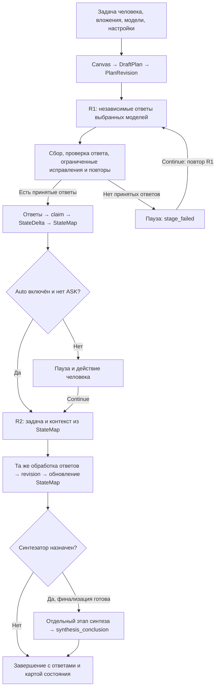

# Pipeline Test: база для новых сценариев

Срез реализации: **2.81.620, 7 октября 2026**. Документ можно целиком передать
другой модели как контекст для проектирования новых pipelines.

## Что реализовано

**Test — минимальный встроенный сценарий из двух последовательных этапов
на общем движке Debate.** На первом выбранные модели независимо отвечают
на задачу; на втором работают с задачей и принятыми результатами первого.
При выборе синтезатора добавляется отдельный итоговый этап.
Предметная логика нового сценария должна задаваться поверх этого механизма.

| Параметр | Значение Test |
| --- | --- |
| Идентификаторы | `presetId: TEST`, `profileId: UNIVERSAL_STANDARD` |
| Режим по умолчанию | `auto`; явный выбор Auto пользователя имеет приоритет |
| План на canvas | Два раунда, `roundLimit: "2"` |
| Модели | Пользователь выбирает сам; предвыбранных моделей нет; минимум одна |
| Длина | По умолчанию не более **700 слов на ответ** |
| Мини-промпты | `noMiniPrompts: true`, None в обоих раундах |
| Предметный каталог этапов | Отсутствует: у Test нет `stageTemplate` |
| Синтез | По умолчанию выключен; добавляется при явном назначении модели |

В конфигурации есть `roles: ['participant', 'critic']`, но при None роли
не назначают критиков автоматически. R2 имеет назначение `response`, а не
`critique`: это общий следующий вклад, без собственного задания Test.

## Схема работы

Схема показывает обычный успешный проход. Пауза/провал обрабатываются
после любого этапа; Continue при провале повторяет **этот же этап**,
а при обычной паузе разрешает следующий. При Auto off пауза возникает
после каждого этапа, окончательная финализация управляется человеком.
Общий Planner может назначать дополнительную работу по состоянию дела:
два раунда обозначают исходный план, а не число транспортных вызовов.

## Что происходит на каждом этапе

1. **Планирование.** Canvas задаёт участников через `send`.
   Из раундов создаются `canvas-r1` (`purpose: position`, результат `claim`)
   и `canvas-r2` (`purpose: response`, результат `revision`).
   R2 зависит от завершения R1 через `upstream`. DraftPlan превращается
   в версию исполняемого плана; Planner выбирает следующий доступный этап.
2. **Промпт.** Компилятор объединяет контракт задачи, операцию этапа,
   контекст и ограничение длины. None убирает дополнительный мини-промпт,
   но сохраняет общие инструкции движка. R1 просит независимую позицию;
   R2 использует общий шаблон операции `response`.
3. **Вызов моделей.** Несколько участников этапа отправляются одной
   логической параллельной пачкой; фактическую работу с вкладками выполняет
   общий транспорт. Для каждой модели есть собственный `transportRequestId`
   и маркер доставки `[[AO-…]]`. Новые страницы, если включены,
   открываются при первой отправке; следующие этапы продолжают в этих вкладках.
4. **Приём.** Транспорт связывает ответ с запросом, затем StageExecutor
   проверяет непустоту, отсутствие текста ошибки, длину и признаки обрыва.
   По умолчанию доступны две попытки участника; при нарушении контракта
   внутри попытки возможен дополнительный запрос исправления.
   Поэтому две стадии с N моделями не гарантируют ровно `2 × N` вызовов.
5. **Фиксация.** Принятый ответ становится артефактом с автором и происхождением,
   затем StateDelta атомарно применяется к состоянию дела. Из него
   строится StateMap для следующих промптов, планирования и отображения.

R2 получает контекст **из StateMap через ContextBroker**. Это выбор артефактов
с учётом приоритета и бюджета, а не простая склейка всех сообщений.
Обычный текст сохраняется целиком как один `claim` или `revision`;
поддерживается также структурированный ответ с массивом `artifacts`.
Автоматического содержательного разбора каждого тезиса обычного текста здесь нет.

## Переходы и ограничения

- По умолчанию исполнитель ждёт исходы всех участников (`completionMode: all`).
  Если часть ответов принята, исполнитель возвращает `partial`, а оркестратор
  считает этап завершённым и допускает следующий. Наличие ответа каждой модели
  не является обязательным условием перехода в текущей реализации.
- Если никто не дал принятого ответа, запуск останавливается с `stage_failed`.
  Терминальная ошибка транспорта может исключить модель из следующих этапов.
- Маркер `[[ASK: вопрос || вариант 1 || вариант 2]]` вызывает паузу;
  ответы человека добавляются в инструкции последующих этапов.
- В полуавтоматическом режиме **Get it** собирает ответы, **next** закрывает
  этап с имеющимися данными. Незавершённый текст может быть принят с пометкой
  `partial`; молчащие модели пропускаются только на этом этапе.
- Отдельный синтез имеет `outputIntent: candidate_final` и запускается при
  готовности к финализации. Обязательные критика, независимая проверка фактов
  и аудит синтеза в исходном Test не заданы. Принятие ответа подтверждает
  прохождение технических проверок, а не истинность содержания.

## Как строить следующий pipeline

Сохранить общий механизм: **план → этап → вызов → приём → артефакты →
состояние → следующий этап**. Для нового сценария определить для каждого
этапа назначение, участников, инструкцию, входные результаты, выходной
документ, условие перехода, паузу и поведение при провале.

Для последовательности с предметными заданиями использовать существующий путь
`stageTemplate`: отдельный каталог по образцу `research-framework.js`, регистрация
в `stage-templates.js`, встроенное определение в `pipeline-presets.js`
и подключение каталога на странице. Интерфейс каталога:
`STAGES`, `PHASES`, `byNumber(n)`, `participantsFor(stage, models)`.
Из него Canvas переносит `purpose`, `instruction`, участников и `meta.gateAfter`
в план. Общие транспорт и жизненный цикл переиспользуются.

Два места требуют внимания при расширении: выбранный мини-промпт сохраняется
как `participant.promptId`, но текущий production-компилятор в `results.js`
его не читает; состав передаваемого контекста также определяет ContextBroker,
а не строгий список из переключателей `input` на canvas. Для обязательных
предметных инструкций использовать `stage.instruction`, а необходимые гарантии
выбора входов и качества результата проверять в коде и тестах.

## Точки входа в код

| Файл / символ | Ответственность |
| --- | --- |
| [`disput/pipeline-presets.js`](../../disput/pipeline-presets.js) | Определение Test и общие параметры пресета |
| [`results.js`](../../results.js): `draftPlanForCanvas`, `startDebateFromPage`, `runModelBatch`, `compilePrompt` | Связь canvas, задачи, движка и транспорта |
| [`debate-draft-plan.js`](../../disput/debate-draft-plan.js), [`debate-planner.js`](../../disput/debate-planner.js) | План, зависимости, выбор следующего этапа |
| [`debate-application.js`](../../disput/debate-application.js), [`debate-orchestrator.js`](../../disput/debate-orchestrator.js), [`debate-stage-executor.js`](../../disput/debate-stage-executor.js) | Запуск, жизненный цикл, выполнение и повторы |
| [`debate-prompt-compiler.js`](../../disput/debate-prompt-compiler.js), [`debate-context-broker.js`](../../disput/debate-context-broker.js), [`debate-prompt-pack.js`](../../disput/debate-prompt-pack.js) | Сборка промпта и контекста |
| [`debate-response-acceptance.js`](../../disput/debate-response-acceptance.js), [`debate-artifact-pipeline.js`](../../disput/debate-artifact-pipeline.js) | Приём ответа и фиксация состояния |

Основание описания — чтение текущего production-кода и локальные проверки:
`pipeline-presets`, `debate-draft-plan`, `debate-artifact-pipeline`,
`debate-application-universal`, `pipeline-semi-auto`: **55 passed, 1 failed**.
Сбой — устаревшее ожидание строки `promptInput.value` в проверке восстановления
ввода; сейчас функция проверяет `pastedTextComposer.getText()`.
Живой прогон провайдеров в рамках этого анализа не выполнялся.
